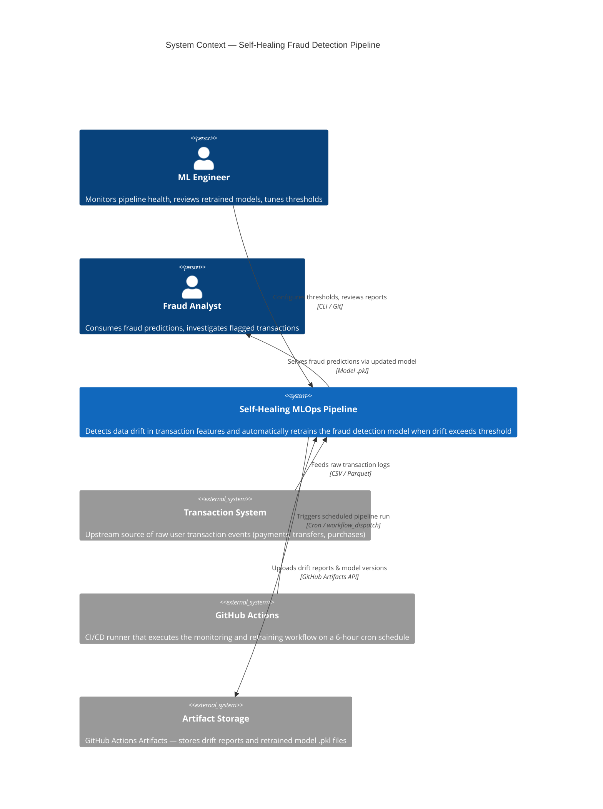

# C4 Level 1 — System Context Diagram

Shows the Self-Healing MLOps Pipeline as a black box, its users, and the
external systems it interacts with.

## Key Observations

| Boundary | Description |
|---|---|
| **Inside the system** | Data generation, drift detection, retraining logic, model serialization |
| **Outside the system** | Transaction data source, CI/CD orchestration, artifact persistence |
| **Latency** | Pipeline is batch-oriented (6-hour cycle). Not real-time inference |
| **Trust boundary** | Transaction data is untrusted input; drift detection validates distributional integrity before retraining |
