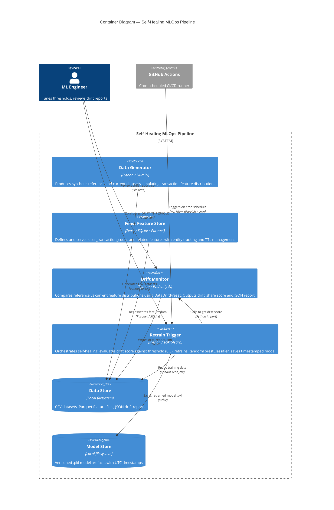

# C4 Level 2 — Container Diagram

Zooms into the Self-Healing MLOps Pipeline to show the major deployable units
(containers), their responsibilities, and the data flows between them.



## Data Flow Summary

```
┌─────────────┐    CSV     ┌──────────────┐  drift_score  ┌─────────────────┐
│  Data Gen   │ ────────→  │  Drift       │ ────────────→ │  Retrain        │
│  (NumPy)    │            │  Monitor     │               │  Trigger        │
└─────────────┘            │  (Evidently) │               │  (scikit-learn) │
                           └──────┬───────┘               └────────┬────────┘
                                  │                                │
                                  ▼                                ▼
                        drift_report.json              fraud_model_<ts>.pkl
```

## Latency & Throughput

| Container | Typical Latency | Bottleneck |
|---|---|---|
| Data Generator | < 1s (1500 rows) | NumPy RNG |
| Drift Monitor | 2–5s | Evidently statistical tests across 3 columns |
| Retrain Trigger | 3–10s | RandomForest fitting (100 trees × 1000 rows) |
| **Total pipeline** | **~10–15s per cycle** | Dominated by model training |
