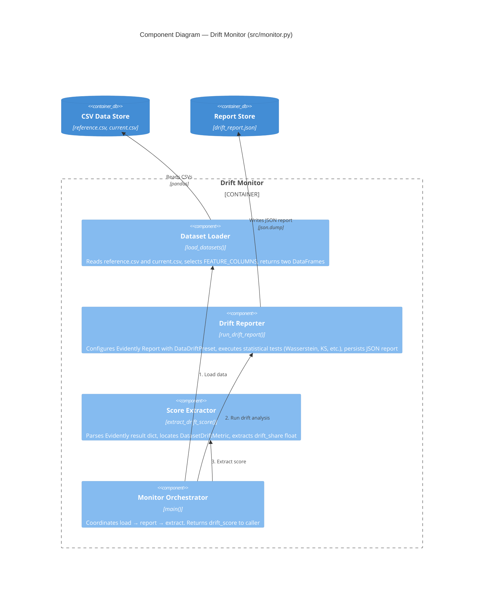
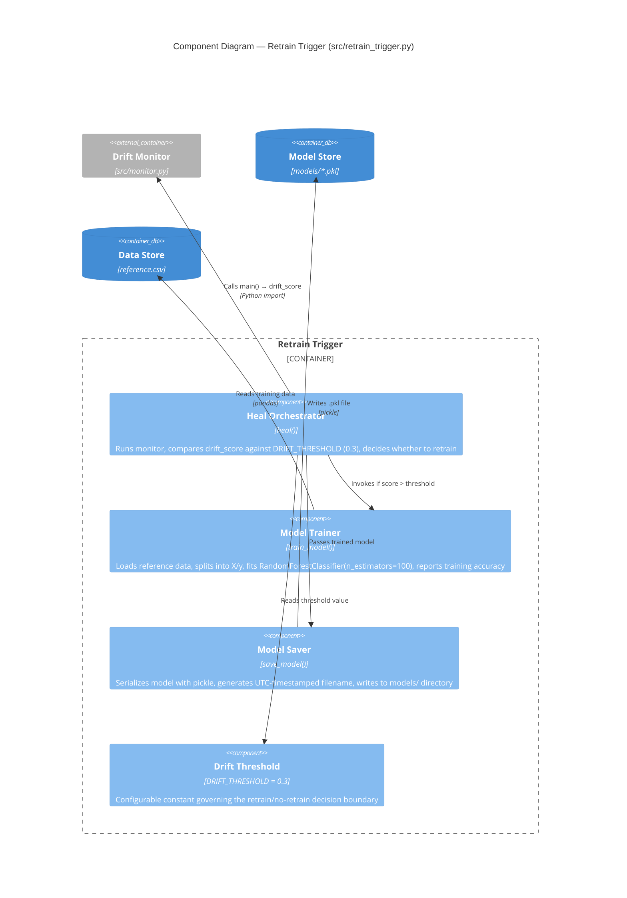
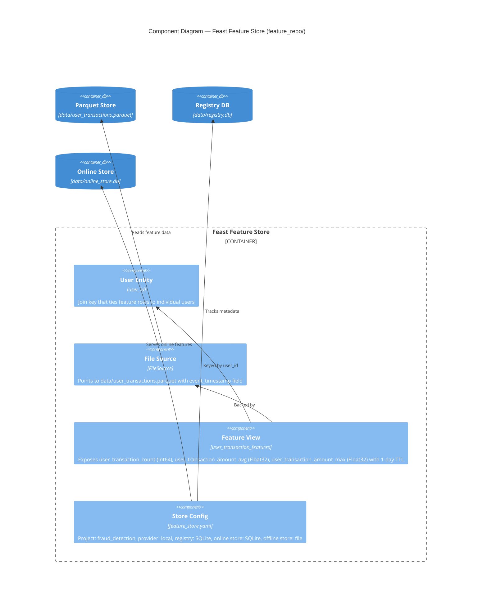

# C4 Level 3 — Component Diagram

Zooms into the **Drift Monitor** and **Retrain Trigger** containers to show
their internal components and interactions.

## Drift Monitor — Internal Components



## Retrain Trigger — Internal Components



## Feast Feature Store — Internal Components



## Component Interaction Map

```
                    ┌────────────────────────────────────────────┐
                    │            Retrain Trigger                  │
                    │  ┌──────────┐  ┌─────────┐  ┌──────────┐  │
  GitHub ──────────→│  │  heal()  │→ │ train() │→ │  save()  │  │
  Actions           │  └────┬─────┘  └─────────┘  └──────────┘  │
                    │       │ drift_score                         │
                    │       ▼                                     │
                    │  ┌────────────────────────────────────┐    │
                    │  │         Drift Monitor               │    │
                    │  │  load() → report() → extract()     │    │
                    │  └────────────────────────────────────┘    │
                    └────────────────────────────────────────────┘
```
