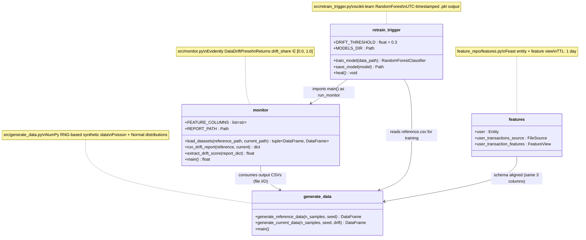
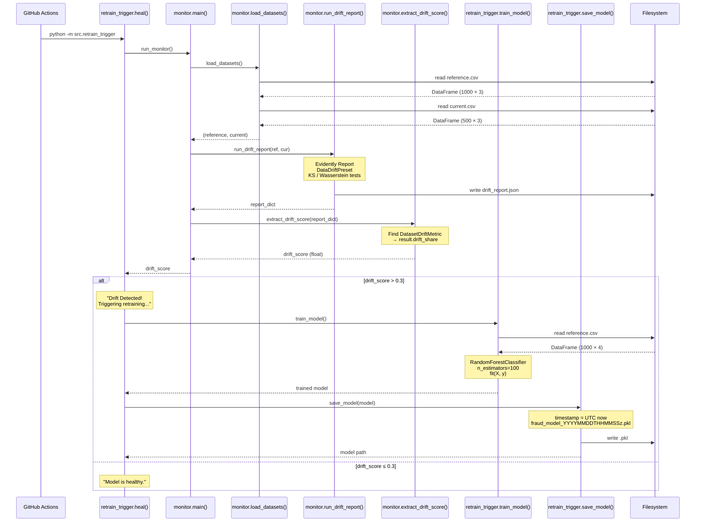
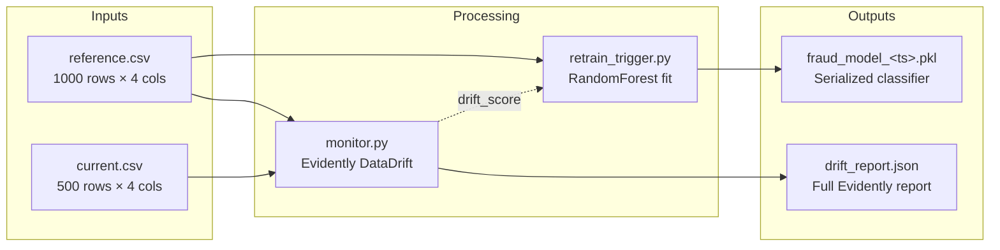

# C4 Level 4 — Code Diagram

Module and function-level view of the pipeline codebase. Shows the actual
Python modules, their public interfaces, and call relationships.

## Module Structure — Class Diagram

## Call Graph — Execution Sequence

## File I/O Map

